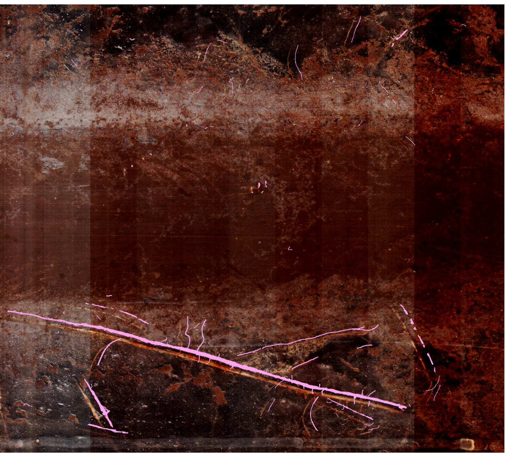
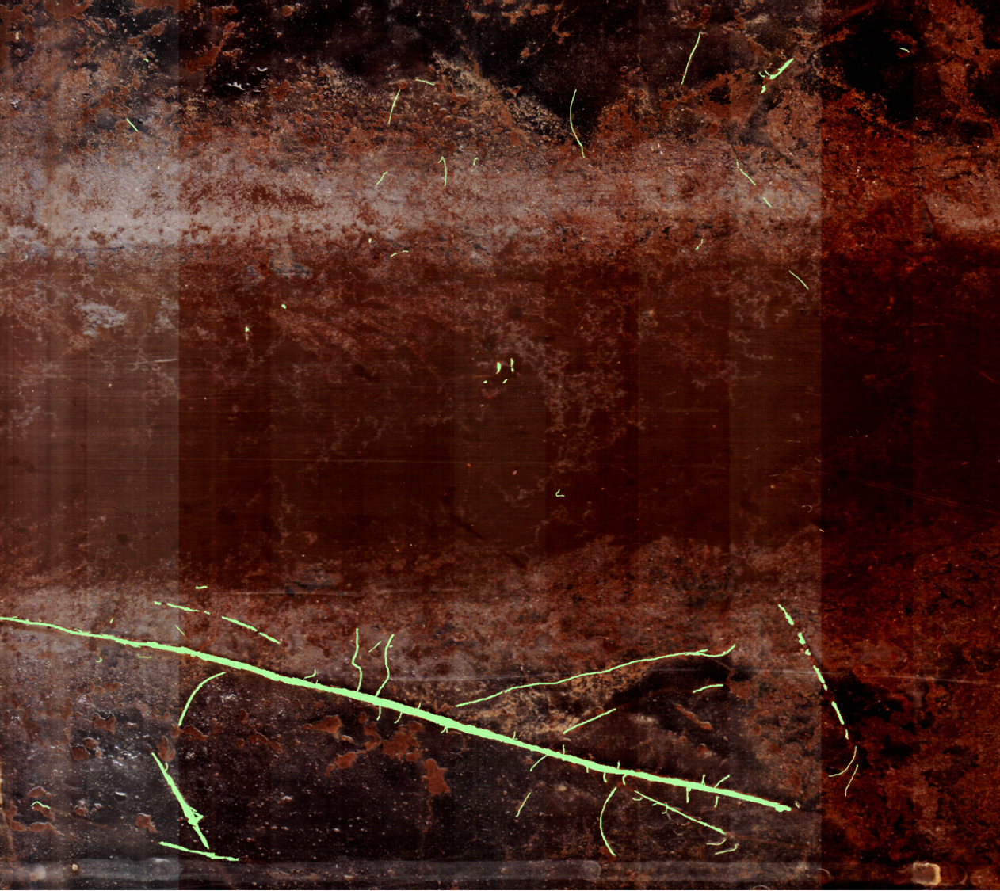
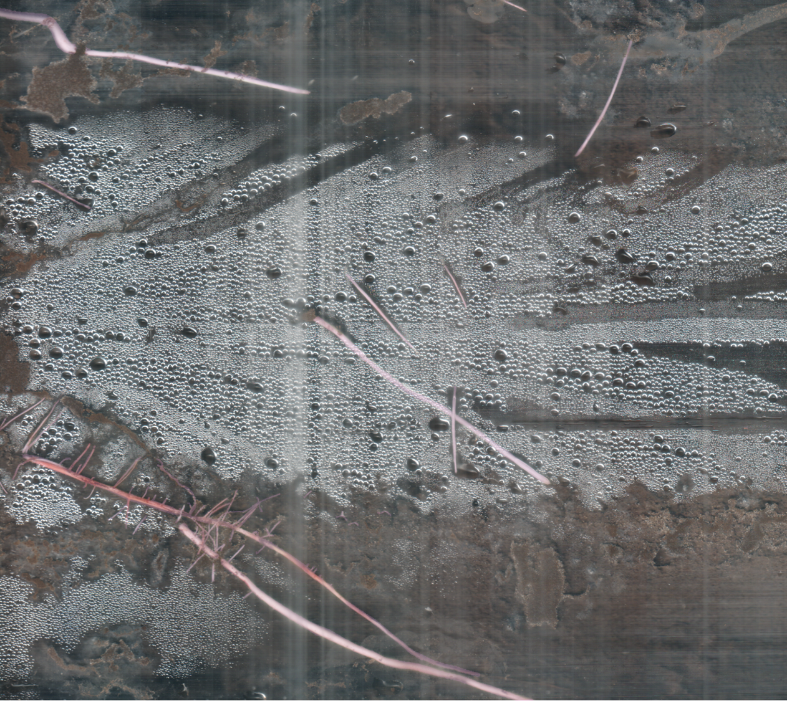
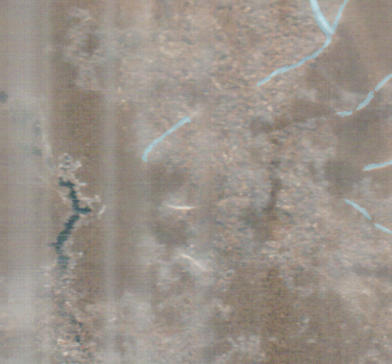
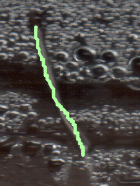
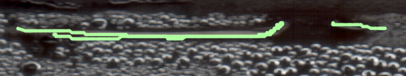
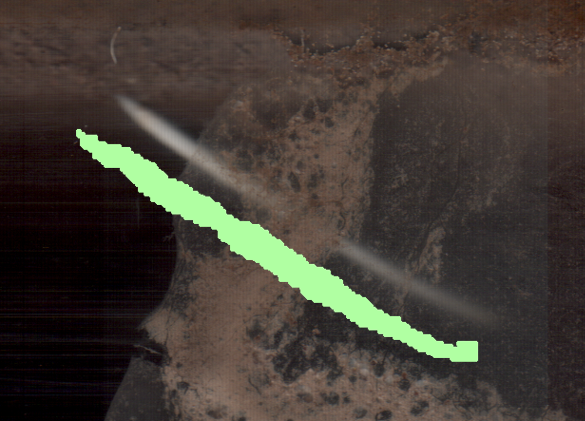
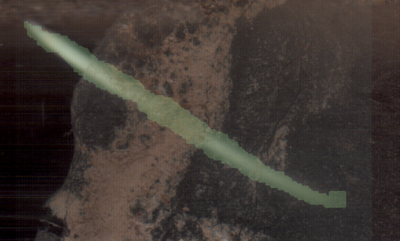
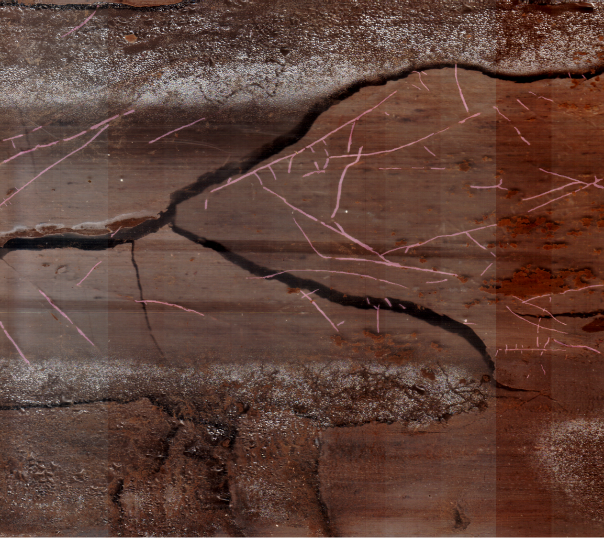

# Root Tracing Annotation Guidelines

## Objective

The primary objective of this task is to accurately trace all visible root structures within each provided image.

## Detailed Tracing Guidelines

Please follow these guidelines carefully to ensure the quality of your annotations:

### 1. Importance of Zooming and Panning

The images provided are very large, and many important root structures, especially fine ones, are very thin and difficult to see at a standard zoom level.

*   **Always use the zoom tool** to magnify the image significantly.
*   **Systematically pan across the *entire* image** after zooming in. Scan methodically (e.g., row by row, or column by column) to ensure you do not miss any areas that might contain roots.
*   Roots can appear anywhere in the image, and are not just clustered at one place. Thorough scanning is essential.

**If you do not zoom in and pan around, you WILL miss many roots, which will compromise the quality of the dataset.**

### 2. Tracing All Roots, Including Thin Ones

*   **Trace *all* visible root structures.** This includes thick primary roots as well as extremely thin, fine roots.
*   **Thin roots are just as important as thick roots** for the success of this project. Do not ignore them because they are difficult to see or trace.
*   Dedicate sufficient time to locating and tracing these fine structures.

### 3. Estimated Time Per Task

*   On average, tracing all roots accurately in an image should take approximately **20 minutes**.
*   Some images may have very complex root systems or be particularly large, requiring **30 minutes or possibly more**.
*   Other images may have very few roots and can be completed in **under 10 minutes**.
*   The provided time estimate is an average. Focus on accuracy and completeness rather than rushing.

### 4. Dedicated Review Time

*   Once you believe you have completed tracing all roots in an image, **allocate at least 5 minutes for a dedicated review.**
*   During the review, zoom back in and systematically pan across the *entire* image again, specifically looking for any roots you might have missed during the initial tracing phase.
*   Compare your tracing overlay with the original image to ensure coverage and accuracy.

**This review step is of utmost importance and is critical for catching missed roots.**

### 5. Identifying Roots

Identifying roots can sometimes be challenging. Roots can vary in color (from white to brown or even black), thickness, and shape. They may also be partially obscured by soil particles or debris.

*   **Learn from the Image Context:** Begin by examining the roots that are clearly visible in the image. Pay close attention to their characteristics – typical color variations, thickness range, surface texture, and how they branch. Use the appearance of these obvious roots to build a mental model of what the less distinct, thinner, or partially obscured roots are likely to look like *within this specific image*. This contextual understanding will significantly help you in identifying and tracing all roots accurately.
*   **Look for typical root structures:** Roots usually exhibit branching patterns, tapering ends, and a generally fibrous or cylindrical appearance.
*   **Distinguish roots from other objects:** Be careful not to trace soil cracks, debris, or other non-root material. Roots typically have a more defined structure than random soil artifacts.

### 6. Accuracy in Tracing

The goal is to create a precise outline of each root.

*   **Avoid over-painting:** Do not draw the outline significantly wider than the actual root structure.
*   **Avoid under-painting:** Ensure your tracing covers the entire width of the root you are tracing. Do not draw too narrowly or miss sections of the root.
*   Trace along the edges of the visible root structure as accurately as possible.
*   For very thin roots, your tracing should follow the path of the root precisely.

**We will be manually verifying a portion of the completed tracings to assess accuracy. Inaccurate tracing (over-painting, under-painting, or missing roots) will reduce the quality of your work.**

## How to Ensure a Good Annotation

A good annotation for this task is one where:

*   **All visible roots**, regardless of thickness, have been traced.
*   The tracing **accurately follows the outline** of each root, without significant over- or under-painting.
*   Non-root objects have **not** been traced.
*   The entire image area has been **systematically scanned** (using zoom and pan) to ensure completeness.
*   A dedicated **review** was performed before submission.

## Common Issues and How to Avoid Them

*   **Missing fine roots:** Avoid by always zooming in and systematically panning across the entire image.
*   **Over- or under-painting:** Avoid by carefully tracing along the visible edges of the root structure. Use zoom to see the edges clearly.
*   **Tracing non-root objects:** Avoid by carefully observing the structure and context of what you are tracing and referring to root identification guidelines.
*   **Incomplete coverage of the image:** Avoid by using the pan tool to scan all areas after zooming.

## Review and Submission

Once you have completed tracing all visible roots in an image and have performed your dedicated review, carefully check your work one last time. Ensure all roots are traced accurately and you haven't missed anything. Then, submit your annotation using the "Submit" button in the interface.

## Examples

**(Insert example images here)**

## Example 1: Good Annotation
*Complete and accurate root tracing with proper boundaries*

**Key features to note:**
- Accurate tracing of thin roots
- Precise boundary delineation
- Complete coverage of root system
  
    **Slightly shifted mask for understanding:**

    

    **Superimposed mask:**

    

    **One more example (slight purple tint indicates the mask):**

    

---

## Example 2: Bad Annotation - Missing Roots
*Demonstrates common error of overlooking fine root structures*

**Issues highlighted:**
- Fine roots were missed during annotation
- Incomplete coverage of root system
- **Reminder:** Use zoom and pan features to capture all root details

---

## Example 3: Bad Annotation - Inaccurate Tracing
*Shows over-estimation and incorrect boundary tracing*

**Under-estimation examples:**

**Tracing plant roots under soil (incorrect approach) and Over-estimation:**

**Key issues:**

- Over-painting beyond actual root boundaries
- Including non-root soil areas in annotation
- Tracing unclear or buried root sections

---

## Example 4: Identifying Roots vs. Non-Roots
*Critical distinction between actual roots and soil artifacts*

**This image demonstrates:**
- Clear differentiation between soil cracks and actual roots
- How to avoid annotating non-root structures
- Proper identification of root vs. debris

---

**Thank you for your contribution to this project! Your attention to detail is highly valued.**
